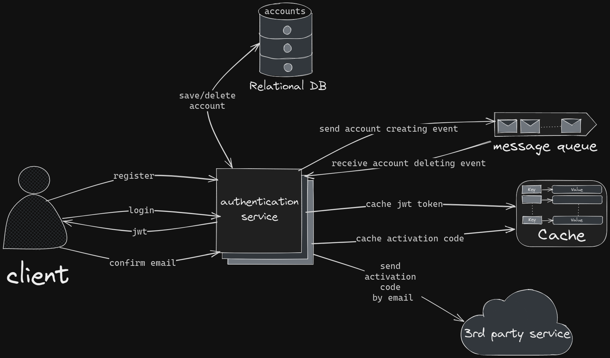

# Authentication service

Authentication service gives you the ability to register and authorize users of your 
application.

## How it works
This service has the API that consists of a few endpoints which provides the ability to
register an account or log in and get access token represented by JWT, as well as activate
account via email message. You can connect your application by subscribing to producer
topic of this service.

## Architecture diagram


## Technology stack

- Java 17

- Spring Boot 3.1.0
- Spring Web
- Spring Security
- Spring Data JPA
- Spring Cloud

- Apache Kafka
- Redis
- PostgreSQL

## How to run application locally
1. Download docker-compose.yml
2. Open downloaded file folder in terminal and enter ```docker-compose up```
3. Wait until all necessary images are pulled and containers are started
4. Now you can make requests from postman or connect your application

## How to work with this service from your application
- First you need to start up the authentication service with all necessary dependencies 
via provided docker-compose file or your own. If you want to run service from 
your docker-compose file, then you have to include config server in order to provide 
necessary configuration for authentication-service
- If you want to communicate with service via kafka, you have to add necessary message model,
which is located in dto/message package
- To subscribe to events with account creation you need to add kafka listener 
that listens to topic 'authentication-service-producer-topic'
- To delete an account you have to publish message to 
'authentication-service-consumer-topic' with the 'DELETE' operation inside
